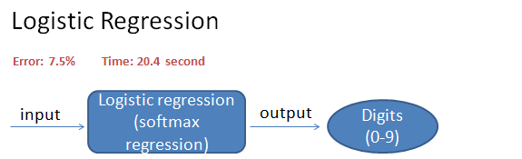
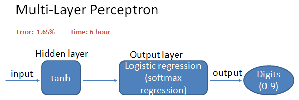
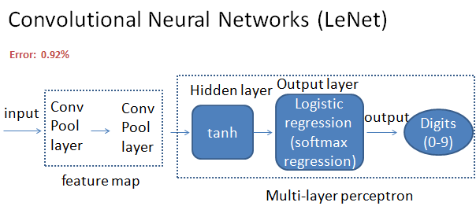
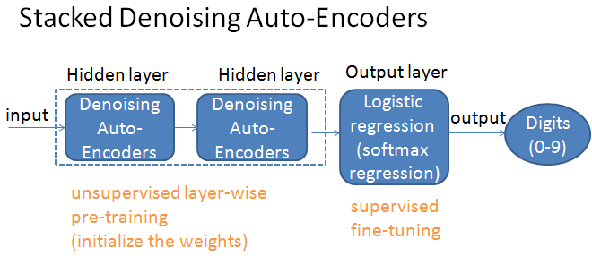
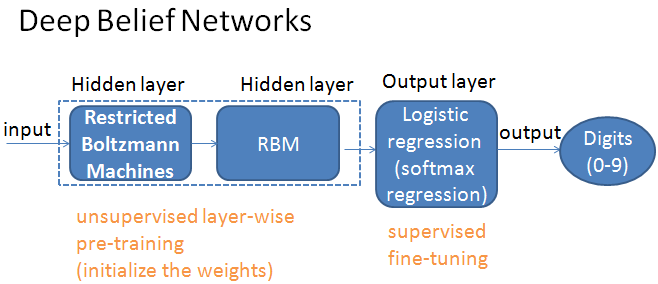

# Deep-Learning-Series-in-Python

[Deep Learning Series 1: Classifying MNIST digits using Logistic Regression](http://nbviewer.jupyter.org/github/yishi/Deep-Learning-Series-in-Python/blob/master/deep_learning_series_1.ipynb)

[Deep Learning Series 2: Classifying MNIST digits using Multi-Layer Perceptron](http://nbviewer.jupyter.org/github/yishi/Deep-Learning-Series-in-Python/blob/master/deep_learning_series_2.ipynb)

[Deep Learning Series 3: Convolutional Neural Networks (LeNet)](http://nbviewer.jupyter.org/github/yishi/Deep-Learning-Series-in-Python/blob/master/deep_learning_series_3.ipynb)

[Deep Learning Series 4: Stacked Denoising Autoencoders (SdA)](http://nbviewer.jupyter.org/github/yishi/Deep-Learning-Series-in-Python/blob/master/deep_learning_series_4.ipynb)

[Deep Learning Series 5: Understand Backpropagation and Gradient Descent](http://nbviewer.jupyter.org/github/yishi/Deep-Learning-Series-in-Python/blob/master/deep_learning_series_5.ipynb)

[Deep Learning Series 6: Classify hand-written digits by keras](http://nbviewer.jupyter.org/github/yishi/Deep-Learning-Series-in-Python/blob/master/deep_learning_series_6.ipynb)

[Deep Learning Series 7: Text Document Classification Using 20 Newsgroups Dataset](http://nbviewer.jupyter.org/github/yishi/Deep-Learning-Series-in-Python/blob/master/deep_learning_series_7.ipynb)

- This data set is a collection of 18,846 messages, collected from 20 different netnews newsgroups. You can get the data from here.
- First of all, we load the data use the function from sklearn package, then use several methods to get the features, then use kinds of traditional machine learning models to fit the data.
- Secondly, we use deep learning algorithm in keras to train the model, because of the limited computer resources, I can not run the whole process.
- Below code is come from:
- http://blog.csdn.net/abcjennifer/article/details/23615947/
- http://keras-cn.readthedocs.io/en/latest/blog/word_embedding/
- http://blog.keras.io/using-pre-trained-word-embeddings-in-a-keras-model.html

**Summary:**

In my exercise, classifying MNIST digits using Logistic Regression, have best test error **7.5%**, but training the model only spend **20.4 second** in my laptop on CPU.

**********************************

Classifying MNIST digits get best test error **1.65%** by using Multi-Layer Perceptron, but training the model spend nearly **six hours** in the same computer on CPU.

**Tiny improve in test error, need more capacity or knoweledge and time.**
> No free lunch.

**********************************
Using CNN to classifying MNIST digits will get test performance **0.92%**.

**********************************

